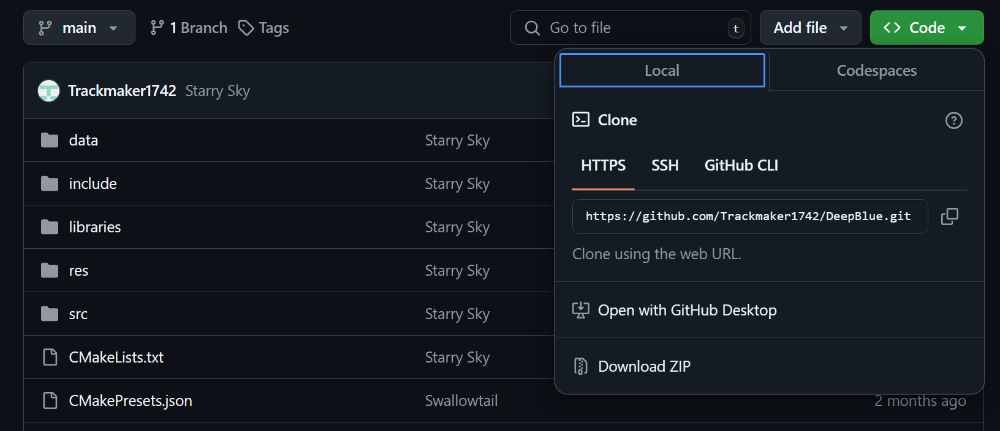

Just a funni little game project about Aitsuki Nakuru here, nothing special 
Still haven't decided on a name yet

Installation instruction 
Download the game by pressing the big green button that said Code, then Download ZIP 
 
Extract the zip file 
Run DeepBlue.exe to start the game

Controls (no input mapping yet):
- WASD for directional movement
- J: accept, jump, place block
- K: cancel, dash, delete block
- U: enter/exit level editor mode
- I: save edit
- O: change from normal block placement (red) to moving block placement 
(green for initial position, blue for end position)
- Arrow keys: navigate block menu
- Esc: pause